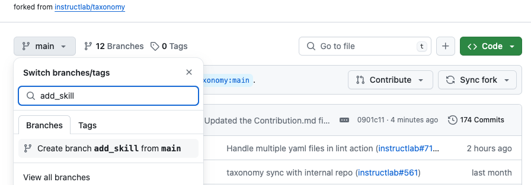
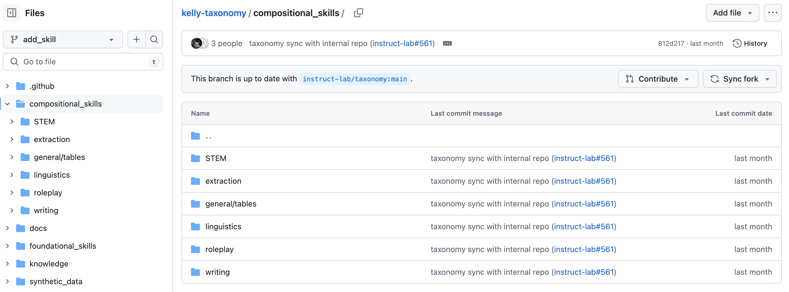
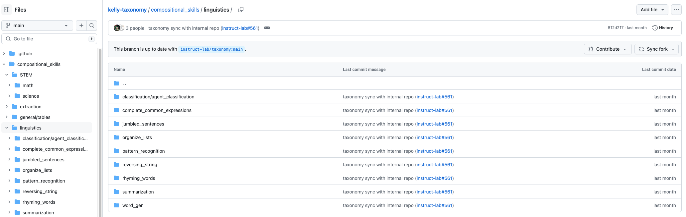
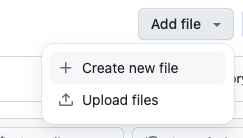
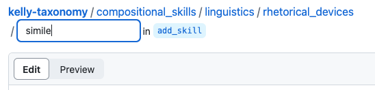
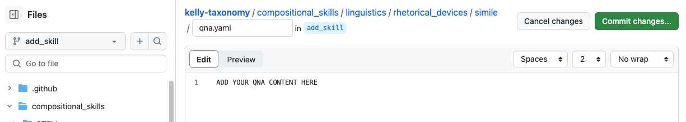

# Contributing using the GitHub webpage UI

There are a few ways you can create pull requests in an open source project: Locally using the git CLI tool in your terminal or using the GitHub webpage user interface. The following instructions show you how to create a PR using the GitHub webpage UI

## Prerequisites

- You have a GitHub account
- You have access to this repo

## Make a copy of the taxonomy repo

1. Go to [github.com/instructlab/taxonomy](https://github.com/instructlab/taxonomy).

2. Click **Fork** to fork your own copy of the repo.

3. On the **Create a new fork** page, enter the information into the following fields:
    - **Repository name:** Name your fork the same as the repository, in this case `taxonomy` is the name of your fork.
    - **Description:** Enter the description of _your fork_, not of the skills you will create. You can write something that makes sense to you or leave it blank.
    - **Copy the main branch only:** The box is selected by default. You can choose to leave the box selected or clear it.

4. Click **Create Fork**.

You will get a copy of the taxonomy repo in your github account. This is your own copy, so don't worry about making mistakes. _If you do end up making a mistake and want to start over: you can delete the fork and create a new fork._

## Contributing a skill

1. IMPORTANT: Before you begin, create a working branch for your contribution and name it whatever you like. This allows you to have an up-to-date `main` branch in your fork as well as a working branch to add any changes.

    

2. Navigate to the directory where you want your knowledge or skill. The following image shows the compositional skills directory and its contents. Skills are contributed to this directory:

    

    The other top-level directory you can contribute to is the knowledge directory, which is used for knowlege contributions. You can read more about the difference between skills and knowledge in the [community documentation](https://github.com/instructlab/community/blob/main/docs/README.md).

3. Based on the directories that exist in the tree, make a best guess at where in the tree structure to add the skill that you want to contribute. If you get to a point where you've gone deep enough into the tree and you can't find any directories that match, create a new directory (and subdirectories, if needed) to best represent your skill.

    For example, I want to train the model to learn how to create sentences using rhetorical devices, specifically similes. I started in the compositional_skills section, and navigated to linguistics.

    

    There is currently no rhetorical_devices folder in the linguistics section, so I can create one called "rhetorical_devices", then click `/` to create another folder called "simile"

    

    

4. It can be a little tricky mechanically to create directories in GitHub's web UI, but you can complete the process using the following steps:

    a. In the GitHub repo, click the folder that you want to create the new directory inside of.

    b. Click Add File and select Create new file from the menu.

    c. Type the name of the first directory that you want to create. The  example image uses rhetorical_devices as the first directory, then metaphor as the next.

    d. After you have entered the name of all of the directories that you want to add, type the file name. The file name should always be qna.yaml (qna stands for "Question aNd Answer.")

    

    e. You can then click "commit changes" to your branch. The GitHub UI will prompt you to open a pull requestion. Select the "open pull request" button.

5. Verify that your YAML follows the proper structure. See [Knowledge: YAML examples](https://github.com/instructlab/taxonomy/blob/main/README.md#knowledge-yaml-examples) and [Skills: YAML examples](https://github.com/instructlab/taxonomy/blob/main/README.md#skills-yaml-examples) to help with formatting. The [yamllint](https://www.yamllint.com/) tool is another great way to verify yaml.
