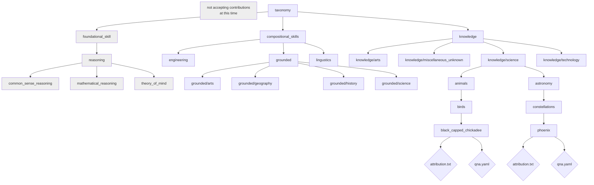

## Taxonomy diagram

> [!Note]
> This diagram shows a subset of the taxonomy. It is not a complete representation.

```mermaid
 flowchart TD;
   na[not accepting contributions\n at this time]:::na
   taxonomy --> foundational_skill & compositional_skills & knowledge

   foundational_skill:::na --> reasoning:::na
   reasoning:::na --> common_sense_reasoning:::na
   reasoning:::na --> mathematical_reasoning:::na
   reasoning:::na --> theory_of_mind:::na

   compositional_skills --> engineering
   compositional_skills --> grounded
   compositional_skills --> lingustics

   grounded --> grounded/arts
   grounded --> grounded/geography
   grounded --> grounded/history
   grounded --> grounded/science

   knowledge --> knowledge/arts

   knowledge --> knowledge/miscellaneous_unknown
   knowledge --> knowledge/science
   knowledge --> knowledge/technology
   knowledge/science --> animals --> birds --> black_capped_chickadee --> black_capped_chikadee-a & black_capped_chikadee-q
   knowledge/science --> astronomy --> constellations --> phoenix --> phoenix-a & phoenix-q

   black_capped_chikadee-a{attribution.txt}
   black_capped_chikadee-q{qna.yaml}
   phoenix-a{attribution.txt}
   phoenix-q{qna.yaml}
   classDef na fill:#EEE
```
