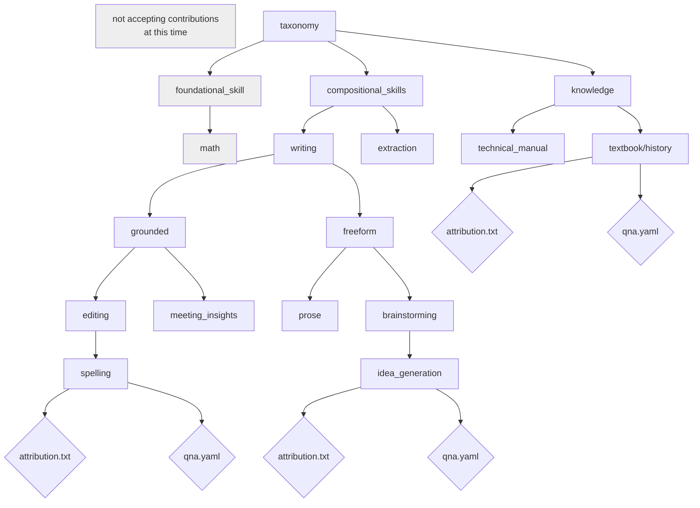

## Taxonomy diagram

```mermaid
graph TD;
  na[not accepting contributions\n at this time]:::na
  taxonomy--> foundational_skill & compositional_skills & knowledge
  foundational_skill:::na --> math:::na
  compositional_skills --> writing & extraction
  writing --> grounded & freeform
  grounded --> editing & meeting_insights
  freeform --> prose & brainstorming
  brainstorming --> idea_generation -->idea_generation-a & idea_generation-q
  idea_generation-a{attribution.txt}
  idea_generation-q{qna.yaml}
  editing --> spelling --> spelling-a & spelling-q
  spelling-a{attribution.txt}
  spelling-q{qna.yaml}
  knowledge --> technical_manual & textbook/history
  textbook/history --> history-a & history-q
  history-a{attribution.txt}
  history-q{qna.yaml}
  classDef na fill:#EEE
```
