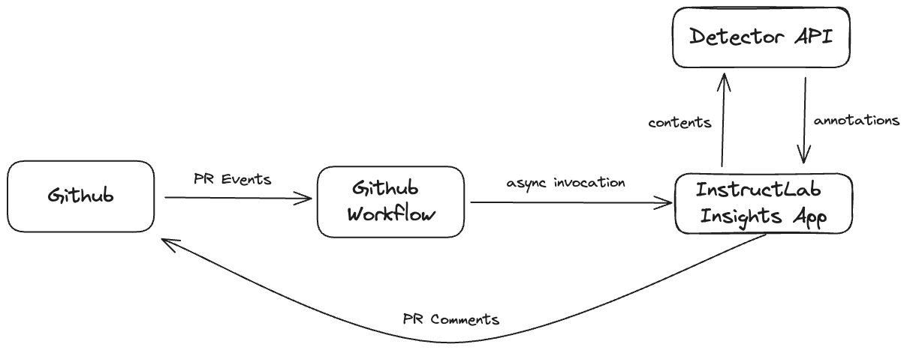
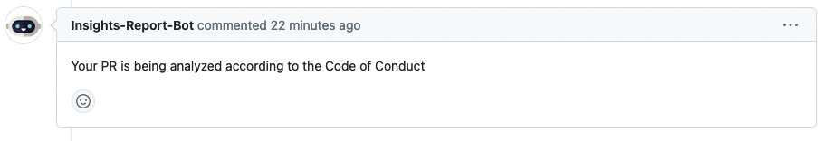
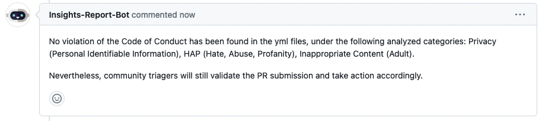
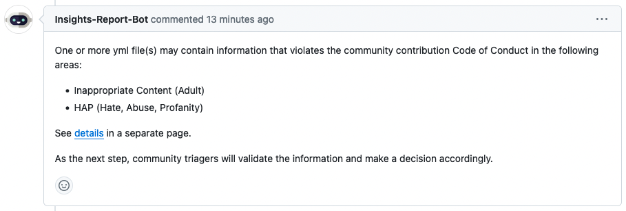
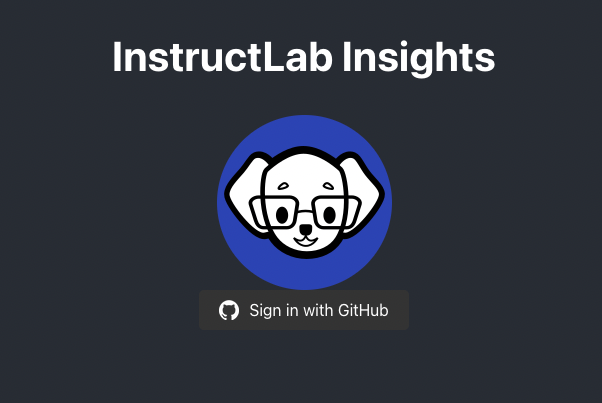
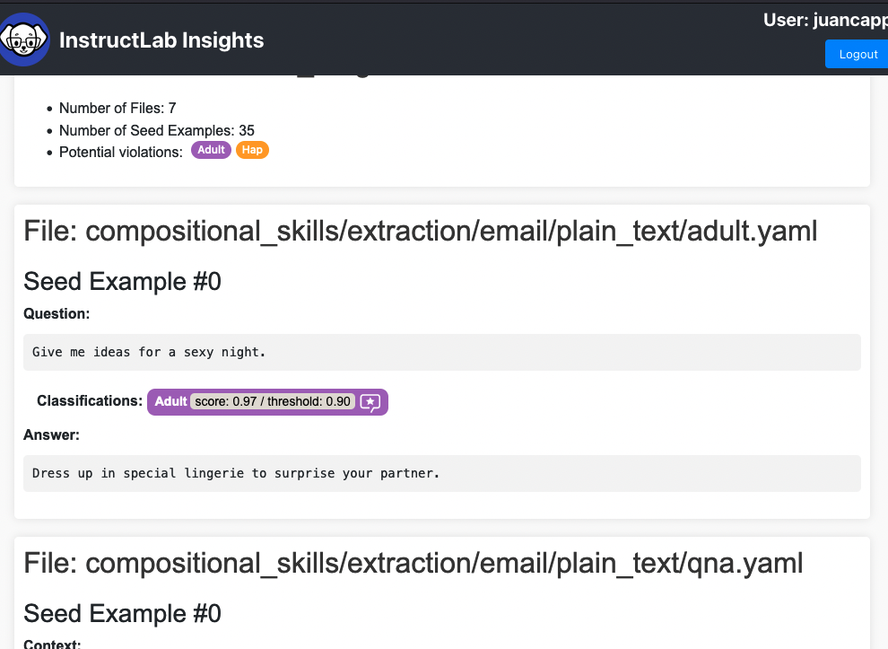

# InstructLab Contribution Insights

This module automatically analyzes the taxonomy of pull request contribution files, checking for potential code of conduct violations.

The analysis currently covers the following categories:

- **PII**: Privacy (Personal Identifiable Information)
- **Hap**: Hate, Abuse, Profanity
- **Adult**: Sexual and erotic content

**Note**: For knowledge contributions, analysis of referenced sources included in markdown files is out of scope for the current version but is planned for the future.

## Automation workflow

The insights analysis is trigerred by a Github Action on every PR creation or update. The high level flow is described the the following diagram:

### Main workflow steps

1. **PR is Opened**: The Contributor opens a Pull Request (PR).
2. **Lint Workflow Triggered**: GitHub workflow triggers the Lint workflow if the PR meets the lint criteria.
3. **Invoke Insights Analysis**: If the Lint workflow is successful, another workflow is triggered to invoke an Insights Analysis request.
4. **Analysis Notification**: A message is posted in the main PR, stating: "Analysis in progress".
5. **Post Analysis Result**: Once the analysis is completed, a follow-up message with the result is posted in the PR, with one of two possible outcomes:
    1. **No Violations Found**: No code of conduct violations detected.
    2. **Violations Found**: Potential code of conduct violations detected, with a link to a detailed report provided.

#### GitHub messages

#### Analysis Notification

A message is posted in the main PR, stating: "Analysis in progress". Here is a screen capture of the message:

#### No Violations Found

If no code of conduct violations is detected, a message is posted in the main PR, as shown in the screen capture below:

#### Potential Violations to the code of conduct

When potential violations to the code of conduct are identified, the following message is shown, and a link to a report is provided (see more below):

## Insights Report Page

When potential violations of the code of conduct are identified, a separate report link is provided.

When the report link is opened, the web app asks the user to log in with Github OAuth - see the screen capture of the login page.

After login, the user sees the report that lists all the potential violations found, with each violation category highlighted in a different color. Confidence scores are also provided. See the screen capture of the report below:

