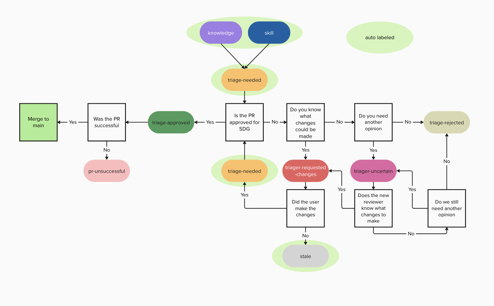
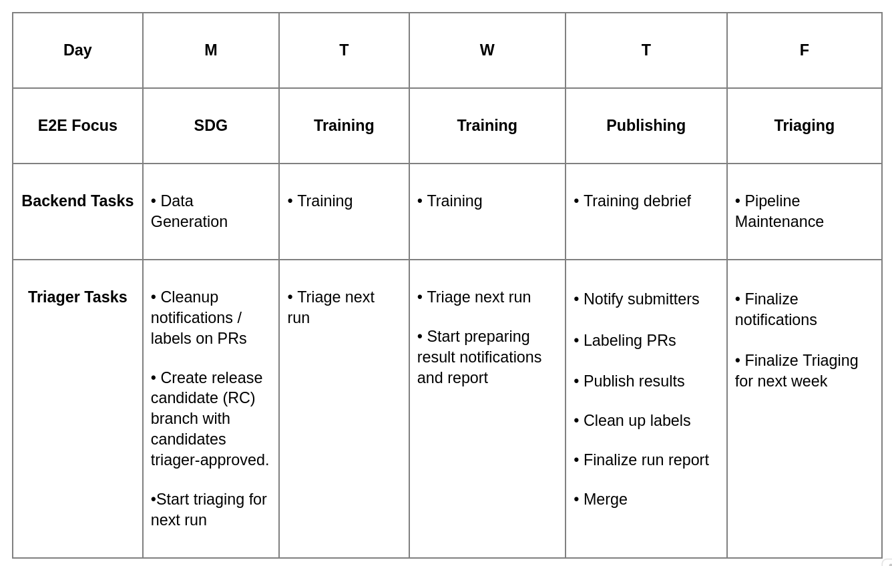

## Triaging contributions

- [Triaging guide](#triaging-guide)
  - [Basic review questions](#basic-review-questions)
  - [Subjective review questions](#subjective-review-questions)
- [Triager responsibilities](#triager-responsibilities)
  - [Labels](#labels)
  - [Label workflow guide](#label-workflow-guide)
- [Triaging schedule](#triaging-schedule)

## Triaging guide

Before you begin, familiarize yourself with the basic concepts around skills and knowledge, as well as the file formats for compositional skills, grounded vs freeform skills, and knowledge.

- [InstructLab Community Learning Guide](https://github.com/instructlab/community/blob/main/docs/README.md)
- [Taxonomy README](../README.md)

Triaging is the practice of reviewing existing [skill and knowledge pull requests (PRs)](https://github.com/instructlab/taxonomy/pulls?q=is%3Apr+is%3Aopen+label%3Askill) to make sure they're relevant, actionable, and have all the information needed to be fully evaluated by both the Taxonomy Triage team (Triagers, @taxonomy-triagers) and the Taxonomy Approvers (Approvers, @taxonomy-approvers).

Triagers review open pull requests and use labels to manage their state and any actions needed. Triagers are also encouraged to provide informative and helpful comments either back to the contributor, to other Triagers or to the Approvers. And remember to be nice.

> [!IMPORTANT]
> Triagers DO NOT MERGE skills pull requests. This action will be done after final approval by @taxonomy-approvers

### Basic review questions

- Does the PR have the pull request template information filled out?
  - If skill has not been run through lmdk, assign unverified label
- Did all the PR checks pass?
- Does the skill have 5 or more examples?
  - **NOTE 2024-03-12:** This has been increased from 3 in the most recent guidance from the approvers!
- Make sure fields in YAML are correct
  - configure tooling eventually: linting, formatting
- No PII in content (may eventually be automated)
- No toxic or hateful content (HAP - hate abuse and profanity) (may eventually be automated)
- Was response clearly generated by LLM (not easy but if very obvious) (may eventually be automated)

### Subjective review questions

- Is this a skill or knowledge
- Do we think that the model could actually be improved by the examples?
  - Is this a skill that you can even teach an LLM
- Is the skill appropriately placed within the taxonomy? (If outside of skill directory, address the issue)

> [!NOTE]
> The skill taxonomy structure is used in several ways:
>
> 1. Selecting the right subset of the taxonomy to use for data generation.
> 2. Interpretability by human contributors and maintainers.
> 3. As part of the prompt to the model used to generate synthetic samples.
> Therefore: Make sure the names of directories match the intent of the
> taxonomy files, perhaps also see if there's a more logical place in the
> taxonomy structure for a person's contribution to live before signing off.

### Potential automation: (at a later date)

- HAP filtering
- PII filtering
- sanity check: is model response similar or complete different from provided by contributor?
- sanity check: is this a skill that you can even teach an LLM?
- generation check: do the teacher-model-generated instructions actually make sense with the skill being added?

## Triager Responsibilities

### Labels

There are a few labels that the triager is responsible for when reviewing PRs:

- https://github.com/instructlab/taxonomy/labels/ci - the PR touches our CI system
- https://github.com/instructlab/taxonomy/labels/enhancement - the PR has a new feature or request
- https://github.com/instructlab/taxonomy/labels/knowledge - the PR is a knowledge contribution
- https://github.com/instructlab/taxonomy/labels/legal-hold - the PR is a good suggestion but we need legal signoff, or review
- https://github.com/instructlab/taxonomy/labels/github_actions - the PR touches our GitHub Actions configuration
- https://github.com/instructlab/taxonomy/labels/help%20wanted - extra attention is needed
- https://github.com/instructlab/taxonomy/labels/question - further information is requested
- https://github.com/instructlab/taxonomy/labels/precheck-generate-ready - The PR has passed all the linting and "code" now is in the model enagegment loop
- https://github.com/instructlab/taxonomy/labels/sdg-unsuccessful - PR failed Synthetic Data Generation
- https://github.com/instructlab/taxonomy/labels/stale - the stale-bot has marked you as stale
- https://github.com/instructlab/taxonomy/labels/skill - a skills contribution as opposed to documentation contribution or a knowledge contribution
- https://github.com/instructlab/taxonomy/labels/topic-failure - a topic that we are not accepting (leave comment on specifics)
- https://github.com/instructlab/taxonomy/labels/triage-approved - triage team has signed off
  - re-assign to @taxonomy-approvers
  - add comment and tag @taxonomy-approvers
- https://github.com/instructlab/taxonomy/labels/triage-follow-up - triager needs to follow up after requested changes have been made
- https://github.com/instructlab/taxonomy/labels/triage-needed - skill needs a triager to review it
  - triager assigns to themself when you beginning review
- https://github.com/instructlab/taxonomy/labels/triage-requested-changes - skill has been reviewed; changes requested from contributor
  - triager provides comment in PR asking for additional changes or information
  - triager assigns to contributor
- https://github.com/instructlab/taxonomy/labels/triage-rejected - skill fails criteria
  - add informative comment while tagging @taxonomy-approvers
  - re-assign to @taxonomy-approvers
- https://github.com/instructlab/taxonomy/labels/triage-uncertain - triager is uncertain which can be for a variety of reasons
  - triager stays assigned
  - use comment to ask the rest of the triage team for input tagging @taxonomy-triagers
  - if still uncertain
    - then re-assign to @taxonomy-approvers
    - triager tags @taxonomy-approvers in informative comment asking for further review from that team

### Label Workflow guide

### Helpful guidance for different determinations

#### Reasons for approval

- Generation seeds (successfully creates more instructions in a `.jsonl` file)
- Meets all criteria

#### Reasons for needing further review

- Needs more extensive edits
- General "I Don't Know"
- Safety tasks and skills should always be escalated to @taxonomy-approvers
- Super interesting, warrants further study

#### Reasons for rejection

- Submitted knowledge not a skill. For example, troubleshooting on an uncommon IBM Storage Fusion error message.
- Obvious LLM answer, blocklist.
  - If you're not familiar with what ChatGPT / Bard / etc writing typically looks like, play with it a bit until you can recognize the tone and linguistic patterns.
- Couldn’t verify that the model actually lacks the skills — i.e. model can already answer the submitted questions well enough.
- Provide examples of model response is too short and neglected reasoning details. For example: A logical question requires multi-step reasoning to reach to the final answer. The submitted model response only gives the final answer.
- Uninformative examples. For example, not all examples match the skill requested; Or the user didn’t put three independent question/answer pairs for the skill, but mistakenly submitted three chat turns for the three questions/answer pairs. Or overly repetitive examples which do not help to clear define of the requested skill.
- Missing examples: didn’t provide desired model response for the skill.

> [!NOTE]
> Skills triagers should try to include as much information as to why the contribution is rejected.
>
### Scrubbing data from issues and pull requests

- Title: edit title to remove information
- Comment: simply edit or delete a comment; if info is very sensitive and needs to be fully deleted, after editing the comment, use the edit history dropdown menu in the comment to delete previous versions of the comment’s content
- Description of issue or pull request cannot be simply deleted, so follow process above to edit and delete history revisions
- Code (in pull request files):
  - Do NOT close PR or delete source branch yet (**important** as this would disconnect the PR from the PR source branch and the PR's changed files view remain visible)
  - Edit/delete the files on the forked branch (clone the fork, checkout the PR's branch, edit the file(s), git amend last commit or reset HEAD~n to revert last n commits, force push)
  - Now close PR, delete source branch
  - The original now orphaned commits can still be found, but it takes some effort and the changed files view no longer shows any of the sensitive information
  - Edit any comments on the PR with sensitive info and delete the previous versions

## Triaging schedule

